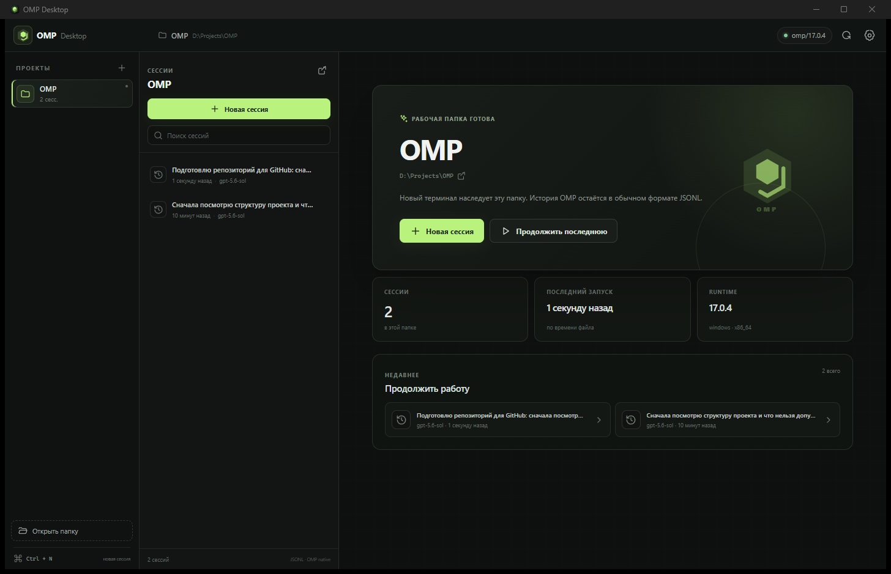

# OMP Desktop

[](https://github.com/Omnividente/omp-desktop/releases/latest)


**[Русский](#русский) · [English](#english)**



## Русский

**OMP Desktop** — кроссплатформенный графический клиент для [Oh My Pi](https://github.com/can1357/oh-my-pi). Он объединяет проекты, историю сессий и живые терминалы OMP в одном нативном приложении для Windows и Linux.

### Возможности

- Проекты и недавние рабочие папки в боковой панели.
- Автоматическое обнаружение стандартных JSONL-сессий OMP.
- Поиск, открытие и возобновление существующих сессий.
- Несколько одновременно работающих терминальных вкладок.
- Настоящий нативный PTY с изменением размера, прерыванием и корректным завершением процессов.
- Настраиваемые путь к OMP, аргументы запуска, shell, тема и размер шрифта.
- Единая кодовая база и установщики для Windows и Linux.

### Установка

1. Установите и настройте OMP для текущего пользователя.
2. Откройте [последний GitHub Release](https://github.com/Omnividente/omp-desktop/releases/latest).
3. Выберите пакет:
   - Windows: `OMP-Desktop_*_x64-setup.exe` или MSI.
   - Linux: AppImage или DEB.

Для AppImage:

```bash
chmod +x OMP-Desktop_*.AppImage
./OMP-Desktop_*.AppImage
```

Для Debian/Ubuntu:

```bash
sudo apt install ./OMP-Desktop_*_amd64.deb
```

## English

**OMP Desktop** is a cross-platform graphical client for [Oh My Pi](https://github.com/can1357/oh-my-pi). It brings projects, session history, and live OMP terminals into one native desktop application for Windows and Linux.

### Features

- Project sidebar with persisted recent workspaces.
- Automatic discovery of standard OMP JSONL sessions.
- Search, open, and resume existing sessions.
- Multiple concurrent terminal tabs.
- A real native PTY with resize, interrupt, and reliable process cleanup.
- Configurable OMP executable, launch arguments, shell, theme, and terminal font size.
- One codebase and installable packages for Windows and Linux.

### Installation

1. Install and configure OMP for the current OS user.
2. Open the [latest GitHub Release](https://github.com/Omnividente/omp-desktop/releases/latest).
3. Choose a package:
   - Windows: `OMP-Desktop_*_x64-setup.exe` or MSI.
   - Linux: AppImage or DEB.

## Development

Requirements: Node.js 22+, Rust 1.84+, OMP, and the [Tauri 2 platform prerequisites](https://v2.tauri.app/start/prerequisites/).

```bash
npm ci
npm run tauri dev
```

Verification:

```bash
npm run build
cargo test --manifest-path src-tauri/Cargo.toml
cargo clippy --manifest-path src-tauri/Cargo.toml --all-targets -- -D warnings
```

Create native packages:

```bash
npm run tauri build
```

## Architecture

- `src/` — React UI and xterm terminal views.
- `src-tauri/src/sessions.rs` — OMP session discovery and metadata parsing.
- `src-tauri/src/terminal.rs` — portable PTY lifecycle and event streaming.
- `src-tauri/src/settings.rs` — runtime detection and persisted local settings.
- `src-tauri/src/lib.rs` — Tauri command surface and application lifecycle.

## Privacy and security

OMP Desktop stores only local application preferences such as recent folders and executable paths. It does not copy provider credentials or upload session files; authentication and model traffic remain inside the OMP process. Local environment files, OMP state, session JSONL files, databases, keys, and release binaries are excluded from Git.

This is an independent community desktop client and is not part of the OMP CLI distribution.
