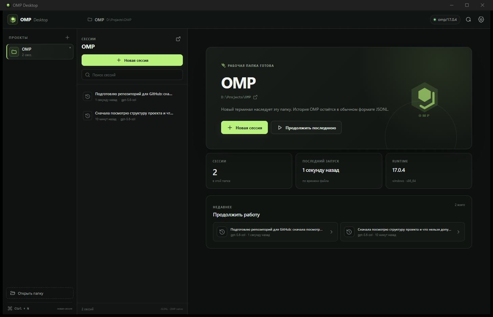

# OMP Desktop

[](https://github.com/Omnividente/omp-desktop/releases/latest)


**[Русский](#русский) · [English](#english)**



## Русский

**OMP Desktop** — кроссплатформенный графический клиент для [Oh My Pi](https://github.com/can1357/oh-my-pi). Он объединяет проекты, историю сессий и живые терминалы OMP в одном нативном приложении для Windows и Linux.

### Возможности

- Проекты и недавние рабочие папки в боковой панели.
- Автоматическое обнаружение стандартных JSONL-сессий OMP.
- Поиск, открытие и возобновление существующих сессий.
- Идемпотентный импорт OMP и Codex JSONL с режимами «пропустить», «обновить» и «создать копию»: JSONL ограничен 256 MiB, связанные артефакты копируются транзакционно без ссылок и ограничены 512 MiB, 10 000 записей и глубиной 16 каталогов.
- Большие транскрипты читаются ограниченно: интерфейс показывает начало и последние записи и явно отмечает пропущенную середину.
- Несколько одновременно работающих терминальных вкладок.
- Настоящий нативный PTY с изменением размера, прерыванием и корректным завершением процессов.
- Настраиваемые путь к OMP, корень сессий, модели, язык и шрифты.
- Монитор системных ресурсов показывает доступную RAM, swap pressure, свободное место для сессий, проекта и временных файлов, а также RSS Desktop и прямых процессов OMP. Он ничего не завершает и не удаляет автоматически.
- Боковая панель имеет сохраняемые режимы «развёрнута», «компактная» и «автоскрытие» (`Ctrl+B`).
- Полные Unicode-названия сессий доступны по наведению и keyboard focus. В терминале `Ctrl+A` явно выбирает текущий ввод OMP для очистки; перемещение мышью ограничено безопасно распознанными wrapped-строками.
- Единая кодовая база и установщики для Windows и Linux.

### Установка

1. Установите и настройте OMP для текущего пользователя.
2. Откройте [последний GitHub Release](https://github.com/Omnividente/omp-desktop/releases/latest).
3. Выберите пакет:
   - Windows: `OMP.Desktop_*_x64-setup.exe` или `.msi`.
   - Linux: AppImage, DEB или RPM.

Для AppImage:

```bash
chmod +x OMP.Desktop_*.AppImage
./OMP.Desktop_*.AppImage
```

Для Debian/Ubuntu (`.deb`):

```bash
sudo apt install ./OMP.Desktop_*_amd64.deb
```

Для Fedora/RHEL/OpenSUSE (`.rpm`):

```bash
sudo dnf install ./OMP.Desktop-*.x86_64.rpm
# или на OpenSUSE:
sudo zypper install ./OMP.Desktop-*.x86_64.rpm
```

## English

**OMP Desktop** is a cross-platform graphical client for [Oh My Pi](https://github.com/can1357/oh-my-pi). It brings projects, session history, and live OMP terminals into one native desktop application for Windows and Linux.

### Features

- Project sidebar with persisted recent workspaces.
- Automatic discovery of standard OMP JSONL sessions.
- Search, open, and resume existing sessions.
- Idempotent OMP and Codex JSONL import with skip, update, and copy modes: JSONL is capped at 256 MiB; related artifacts are copied transactionally without links and capped at 512 MiB, 10,000 entries, and 16 directory levels.
- Large transcripts use bounded reads: the UI shows the beginning and latest entries and explicitly marks the omitted middle.
- Multiple concurrent terminal tabs.
- A real native PTY with resize, interrupt, and reliable process cleanup.
- Configurable OMP executable, session root, models, language, and fonts.
- The resource monitor reports available RAM, swap pressure, free space for sessions, the workspace and temporary files, plus RSS for Desktop and direct OMP processes. It never terminates processes or deletes data automatically.
- The project sidebar has persisted expanded, compact and auto-hide modes (`Ctrl+B`).
- Full Unicode session titles are available on hover and keyboard focus. In the terminal, `Ctrl+A` visibly arms the current OMP input for clearing; mouse movement is limited to safely recognized wrapped lines.
- One codebase and installable packages for Windows and Linux.

### Installation

1. Install and configure OMP for the current OS user.
2. Open the [latest GitHub Release](https://github.com/Omnividente/omp-desktop/releases/latest).
3. Choose a package:
   - Windows: `OMP.Desktop_*_x64-setup.exe` or `.msi`.
   - Linux: AppImage (`.AppImage`), Debian/Ubuntu (`.deb`), or Fedora/RHEL/OpenSUSE (`.rpm`).

AppImage:

```bash
chmod +x OMP.Desktop_*.AppImage
./OMP.Desktop_*.AppImage
```

Debian/Ubuntu (`.deb`):

```bash
sudo apt install ./OMP.Desktop_*_amd64.deb
```

Fedora/RHEL/OpenSUSE (`.rpm`):

```bash
sudo dnf install ./OMP.Desktop-*.x86_64.rpm
```

## Development

Requirements: Node.js 22+, Rust 1.84+, OMP, and the [Tauri 2 platform prerequisites](https://v2.tauri.app/start/prerequisites/).

```bash
npm ci
npm run tauri dev
```

Verification:

```bash
npm run build
npm run test:release-assets
cargo test --manifest-path src-tauri/Cargo.toml
cargo clippy --manifest-path src-tauri/Cargo.toml --all-targets -- -D warnings
```

The manually dispatchable `Quality Gate` runs the same Windows and Linux checks used by a tagged release. Tagged release runs are serialized per tag, and every release job checks out the triggering SHA. Before a draft release becomes public, the workflow requires draft state, confirms that the live tag still identifies that SHA, and verifies platform installers, updater signatures, `latest.json`, and both checksum files.

Create native packages:

```bash
npm run tauri build
```

## Architecture

- `src/` — React UI and xterm terminal views.
- `src-tauri/src/sessions.rs` — OMP session discovery and metadata parsing.
- `src-tauri/src/terminal.rs` — portable PTY lifecycle and event streaming.
- `src-tauri/src/settings.rs` — runtime detection and persisted local settings.
- `src-tauri/src/resource_health.rs` — low-frequency RAM, swap, disk and direct-process sampling.
- `src-tauri/src/lib.rs` — Tauri command surface and application lifecycle.
- `.github/scripts/verify-release-assets.mjs` — final signed-asset and checksum publication gate.

## Privacy and security

OMP Desktop stores local application preferences and provider-key names in `settings.json`. Provider credential values are stored in the operating-system credential store; when that store is unavailable, the app uses a fallback in the per-user application directory (`0600` on Unix, inherited per-user ACLs on Windows) and shows a warning. Import copies the selected JSONL session and a bounded tree of regular artifact files into the configured local OMP session root; links and special files are rejected. OMP Desktop does not upload session files; authentication and model traffic remain inside the OMP process. Local environment files, OMP state, session JSONL files, databases, keys, and release binaries are excluded from Git.

This is an independent community desktop client and is not part of the OMP CLI distribution.
